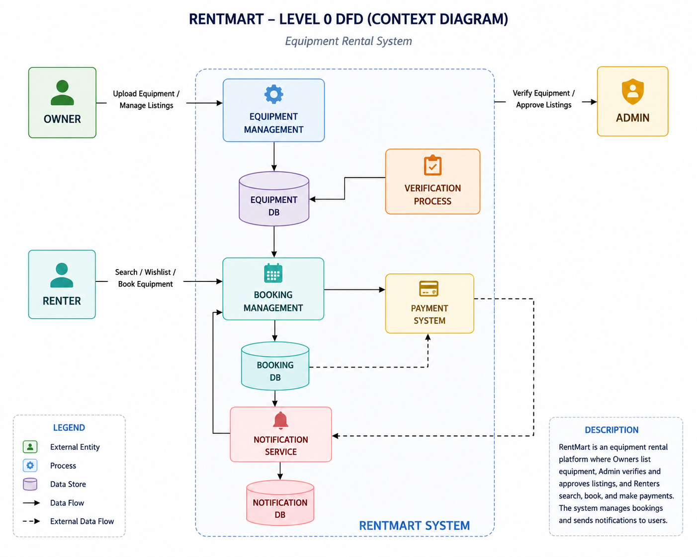
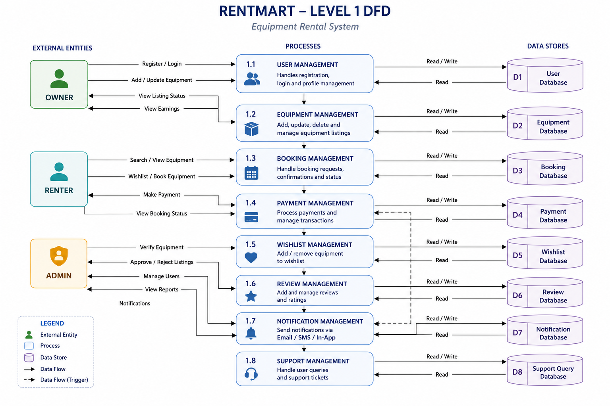
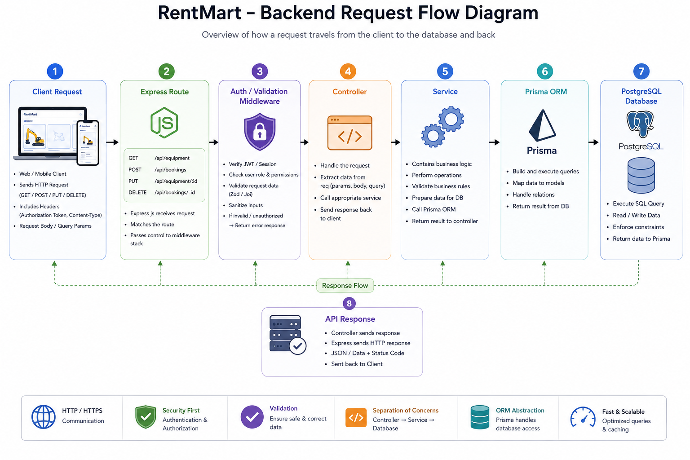
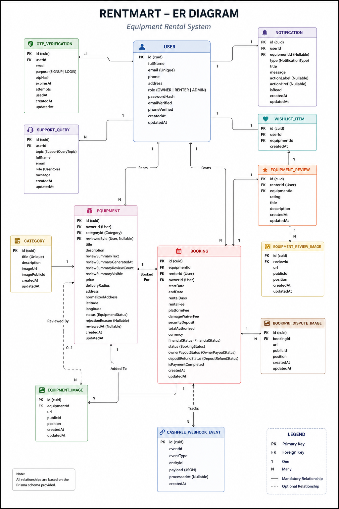
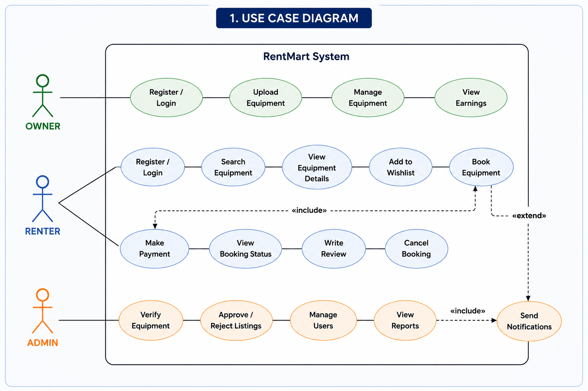
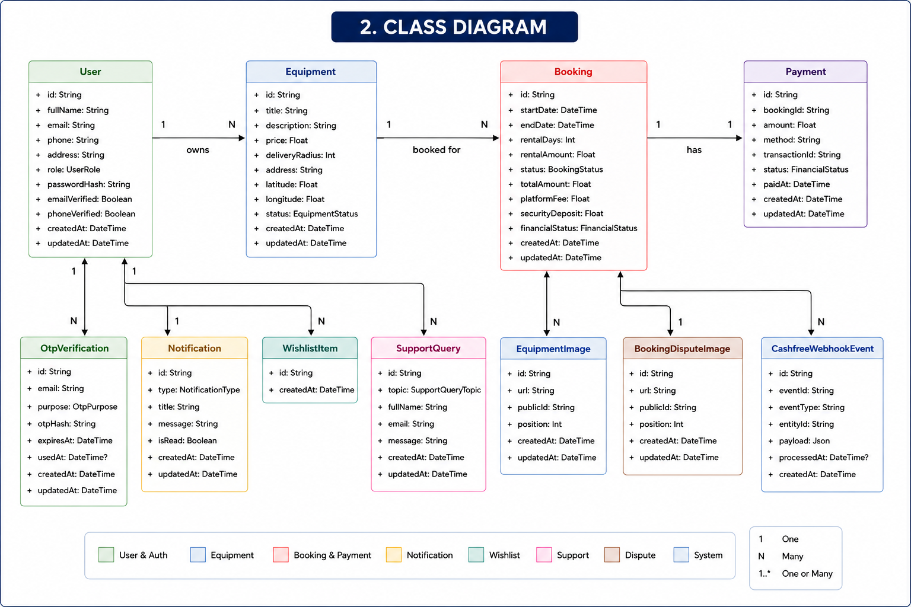
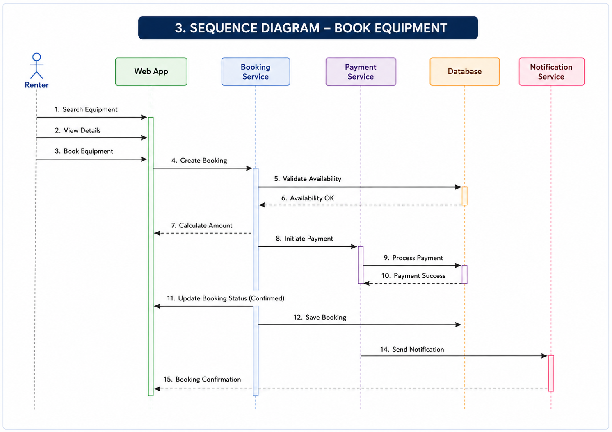

# RentMart Server

RentMart Server is the backend API for the RentMart equipment rental marketplace. It powers authentication, equipment listing, category management, booking lifecycle, payment event handling, notifications, support queries, wishlist operations, and admin governance.

The server is built with **Bun**, **Express 5**, **TypeScript**, **Prisma**, **PostgreSQL**, **Redis**, and **Zod**. It follows a layered backend structure so routes, controllers, services, validators, middleware, and infrastructure integrations remain clear and maintainable.

## Project Purpose

The backend provides the business logic and data layer for a multi-role rental platform.

- Owners can create and manage equipment listings.
- Renters can discover equipment, create bookings, save wishlist items, and receive notifications.
- Admin users can verify listings, manage categories, review support queries, inspect transactions, and supervise platform activity.
- The server enforces authentication, role access, validation, rate limiting, and database consistency.
- The implementation supports academic project evaluation by showing complete modules, testable APIs, and realistic third-party service boundaries.

## Core Features

- User registration, login, OTP verification, profile handling, and password-related flows.
- JWT-based authentication with cookie or bearer-token support.
- Role-aware authorization for admin, owner, and renter operations.
- Email and mobile verification gates for sensitive workflows.
- Equipment category creation, update, retrieval, and image validation.
- Equipment listing creation, owner management, admin moderation, and public browsing.
- Booking request lifecycle from renter request to owner decision and payment state.
- Payment event ingestion and raw event storage for reconciliation.
- Notification creation and read-state handling.
- Support query submission and admin-side queue visibility.
- Wishlist save/remove/list operations for renters.
- Equipment review and review-image data modeling for post-rental feedback.
- Zod validation for request bodies, params, and query values.
- Redis-backed rate limiting for abuse protection.
- Automated tests for validation, middleware, and important workflow rules.

## Technology Stack

| Layer | Technology | Usage in Server |
| --- | --- | --- |
| Runtime | Bun | Fast TypeScript execution, development server, and test runner |
| HTTP framework | Express 5 | API routes and middleware pipeline |
| Language | TypeScript | Strong contracts across backend modules |
| ORM | Prisma | Typed database access and schema-driven modeling |
| Database | PostgreSQL | Relational storage for users, listings, bookings, payments, support, and notifications |
| Validation | Zod | Safe request parsing before service logic |
| Authentication | JWT + cookies | Session and protected route support |
| Password security | bcryptjs | Secure password hashing |
| Rate limiting | Redis | Request throttling and retry metadata |
| File upload | Multer | Image upload intake for listing/category flows |
| Email | Nodemailer / Resend | OTP and communication workflows |
| SMS | Twilio | Mobile verification support |
| Logging | Winston | Structured server-side logging |
| Testing | Bun test | Automated backend test execution |

## Backend Architecture

The backend uses a layered architecture:

- `routes`
  - Defines endpoint paths and middleware order.
- `controllers`
  - Converts HTTP requests into service calls and sends responses.
- `services`
  - Holds core marketplace business logic.
- `validators`
  - Defines Zod schemas for safe input parsing.
- `middlewares`
  - Handles authentication, authorization, validation, rate limiting, and uploads.
- `lib`
  - Contains shared infrastructure helpers such as database, Redis, payment, email, SMS, logging, and utility clients.
- `configs`
  - Stores environment and configuration loading logic.
- `types`
  - Keeps shared backend TypeScript types.
- `tests`
  - Contains automated test files for important modules.

## Architecture and Design Diagrams

The `server/diagrams` folder contains visual design artifacts that are useful during project evaluation, viva explanation, and report presentation.

| Diagram | File | Evaluation Use |
| --- | --- | --- |
| Data Flow Diagram Level 0 | [`diagrams/DFD/DFD-level-0.png`](diagrams/DFD/DFD-level-0.png) | Shows RentMart as a high-level system with external actors and major data movement |
| Data Flow Diagram Level 1 | [`diagrams/DFD/DFD-level-1.png`](diagrams/DFD/DFD-level-1.png) | Breaks the system into backend processes such as auth, listing, booking, payment, support, and notification flow |
| Backend Request Flow Diagram | [`diagrams/Backend/backend-request-flow.png`](diagrams/Backend/backend-request-flow.png) | Illustrates how client requests pass through Express routes, middleware, controllers, services, Prisma ORM, PostgreSQL, and return API responses |
| Entity Relationship Diagram | [`diagrams/ER/ER.png`](diagrams/ER/ER.png) | Shows database entities, primary keys, foreign keys, and relationships used by Prisma/PostgreSQL |
| UML Diagram 1 | [`diagrams/UMLs/UML1.png`](diagrams/UMLs/UML1.png) | Supports object/module-level explanation of core RentMart backend structure |
| UML Diagram 2 | [`diagrams/UMLs/UML-2.png`](diagrams/UMLs/UML-2.png) | Supports workflow and module interaction explanation |
| UML Diagram 3 | [`diagrams/UMLs/UML-3.png`](diagrams/UMLs/UML-3.png) | Supports additional system behavior or class relationship explanation |

### System Data Flow





### Backend Request Flow



### Database ER Diagram



### UML Diagrams







## Folder Structure

```text
server/
├─ diagrams/
│  ├─ Backend/
│  ├─ DFD/
│  ├─ ER/
│  └─ UMLs/
├─ prisma/
│  ├─ schema.prisma
│  └─ migrations/
├─ src/
│  ├─ configs/
│  ├─ controllers/
│  ├─ generated/
│  ├─ lib/
│  ├─ middlewares/
│  ├─ routes/
│  ├─ services/
│  ├─ tests/
│  ├─ types/
│  ├─ validators/
│  └─ index.ts
├─ package.json
├─ tsconfig.json
└─ tsconfig.build.json
```

## API Route Modules

| Route Module | Main Responsibility |
| --- | --- |
| `auth.routes.ts` | Registration, login, OTP, session, profile, and password flows |
| `equipment.routes.ts` | Equipment creation, listing, detail retrieval, owner operations, and admin moderation |
| `category.routes.ts` | Category browsing and admin category management |
| `booking.routes.ts` | Booking request, approval/rejection, rental state, and finance-related transitions |
| `payment.routes.ts` | Payment webhook/event ingestion and admin raw event retrieval |
| `notification.routes.ts` | Notification feed and read-state updates |
| `support-query.routes.ts` | Contact/support query submission and admin review queue |
| `wishlist.routes.ts` | Renter wishlist save, remove, and listing operations |

## Request Lifecycle

Each protected API request follows a predictable flow.

- Route receives the request.
- Zod validator checks body, params, or query values.
- Authentication middleware resolves the current user.
- Authorization middleware verifies role and verification requirements.
- Controller calls the related service.
- Service applies business rules and reads/writes through Prisma.
- Response returns a consistent JSON shape for frontend consumption.
- Errors are handled centrally where possible so client screens receive predictable messages.

## Main Domain Modules

### Authentication and Access

- Supports user onboarding and login.
- Uses OTP verification for identity confirmation.
- Hashes passwords with `bcryptjs`.
- Issues and verifies JWT tokens.
- Resolves authenticated users through middleware.
- Applies role checks for owner, renter, and admin endpoints.
- Uses verification gates for workflows that require confirmed email or mobile status.

### Equipment and Listing Management

- Allows owners to submit equipment listings.
- Supports category association and listing images.
- Lets admins verify, approve, reject, or moderate listings.
- Keeps public marketplace browsing separate from owner/admin management.
- Supports listing detail retrieval for frontend product pages.

### Category Management

- Provides category records for browsing and filtering.
- Allows admin-side creation and maintenance.
- Validates category input and image-related constraints.
- Helps organize marketplace inventory for user-friendly discovery.

### Booking Lifecycle

- Allows renters to request equipment rentals.
- Lets owners approve or reject requests.
- Tracks important booking states and transitions.
- Connects booking records with renter, owner, equipment, and payment information.
- Provides the foundation for renter/owner transaction views.

### Payments and Reconciliation

- Accepts payment-related events through payment routes.
- Stores raw payment event data for admin inspection.
- Maps payment references back to booking records where needed.
- Supports a transaction visibility story for project evaluation.
- Keeps raw event review separate from business ledger views.

### Notifications

- Creates notification records for marketplace events.
- Helps users track account, booking, listing, and verification updates.
- Provides read-state handling for dashboard notification screens.

### Support Queries

- Accepts contact/support messages from authenticated owners and renters.
- Stores support topic, message, role, and user context.
- Exposes admin-side query review for operational handling.

### Wishlist

- Lets renters save equipment for later review.
- Supports remove and list operations.
- Improves continuity between browsing and booking workflows.

### Reviews and Summary

- Stores equipment review records after rental interactions.
- Supports review image records for richer feedback evidence.
- Helps present trust signals and evaluation summaries around listings.

## Database Model Coverage

The Prisma schema supports the main RentMart entities.

The database relationships are also represented visually in [`diagrams/ER/ER.png`](diagrams/ER/ER.png), which is helpful for explaining one-to-many relationships between users, equipment, bookings, notifications, wishlist items, support queries, reviews, and payment events.

- `User`
  - Owner, renter, or admin identity.
- `OtpVerification`
  - OTP records for verification workflows.
- `Category`
  - Equipment classification and browsing structure.
- `Equipment`
  - Main listing record with owner and category relationships.
- `EquipmentImage`
  - Ordered image data for equipment listings.
- `Booking`
  - Rental request, approval, status, and payment lifecycle.
- `CashfreeWebhookEvent`
  - Raw payment event archive for reconciliation.
- `Notification`
  - User-facing event feed records.
- `SupportQuery`
  - Contact/support request storage.
- `WishlistItem`
  - Saved equipment relationship between renter and equipment.
- `EquipmentReview`
  - Feedback and rating-style record for completed equipment interactions.
- `EquipmentReviewImage`
  - Image evidence attached to equipment reviews.
- `BookingDisputeImage`
  - Image evidence for booking dispute-related records.

## Security and Reliability

- Zod validation blocks malformed inputs before business logic runs.
- Prisma protects normal data access through typed queries.
- JWT verification checks token validity before resolving user identity.
- Role middleware protects admin-only and role-specific endpoints.
- Email/mobile verification middleware blocks incomplete verification flows.
- Redis rate limiting reduces abuse on sensitive routes.
- Passwords are stored as hashes, not plain text.
- Raw payment event handling preserves payment debugging and reconciliation evidence.
- Modular services keep business rules centralized instead of duplicated across routes.

## Environment Setup

The server expects environment values for local development and integration services. Keep real secrets outside Git.

Common environment groups:

- Database
  - PostgreSQL connection URL and Prisma settings.
- Auth
  - JWT secret, issuer, token lifetime, and cookie settings.
- Redis
  - Redis host, port, password, or URL for rate limiting.
- Email
  - SMTP, Nodemailer, or Resend credentials.
- SMS
  - Twilio credentials for mobile verification.
- Uploads
  - Image upload configuration used by listing/category flows.
- Payments
  - Cashfree or payment gateway credentials and webhook settings.
- App URLs
  - Client URL, server URL, CORS origin, and redirect targets.

## Local Development

```bash
bun install
bun run dev
```

The development script runs:

```bash
bun --watch src/index.ts
```

## Build and Run

```bash
bun run build
bun run start
```

The build script compiles TypeScript using `tsconfig.build.json`, and the start script runs the compiled output.

## Database Commands

Common Prisma commands during development:

```bash
bunx prisma generate
bunx prisma migrate dev
bunx prisma studio
```

Use these only after configuring the database environment values.

## Testing

```bash
bun test
```

Current automated test modules:

- `auth.test.ts`
  - Authentication validators, helpers, and request validation behavior.
- `booking.test.ts`
  - Booking workflow validation and dispute-related rules.
- `category.test.ts`
  - Category payload and image validation behavior.
- `equipment.test.ts`
  - Equipment payloads, image limits, review inputs, and summary-related validation.
- `rate-limit.test.ts`
  - Rate limiting and request blocking behavior.

The project report records a successful backend test run:

```text
34 pass
0 fail
62 expect() calls
Ran 34 tests across 5 files.
```

## Evaluation Highlights

- Complete modular backend for a real marketplace use case.
- Clear owner, renter, and admin role separation.
- Authentication, verification, validation, and authorization are handled explicitly.
- Equipment, category, booking, payment, notification, support, and wishlist modules are implemented separately.
- Prisma schema supports realistic relational data modeling.
- DFD, ER, and UML diagrams are included under `server/diagrams` for architecture presentation.
- Payment event storage improves auditability and admin reconciliation.
- Automated tests demonstrate repeatable validation of important backend behavior.
- Backend design aligns with the project report chapters on architecture, implementation, testing, result, and future scope.

## Suggested Demo Flow

- Start PostgreSQL, Redis, and the server.
- Register or log in as different user roles.
- Demonstrate OTP and protected route behavior.
- Create or inspect equipment categories.
- Submit an owner listing and show admin verification.
- Create a renter booking request.
- Show booking state movement after owner/admin actions.
- Inspect notifications, wishlist, support queries, and payment event visibility.
- Open `server/diagrams` to explain DFD, ER, and UML design artifacts during evaluation.
- Run `bun test` to show automated backend validation.

## Contributor Notes

- Keep route handlers thin and move business logic into `src/services`.
- Add or update Zod schemas before accepting new request shapes.
- Protect privileged endpoints with authentication and role middleware.
- Keep payment, booking, and transaction changes consistent across database records and admin visibility.
- Add tests when changing validators, middleware, booking rules, auth behavior, or payment-related logic.
- Update this README when new route modules, environment groups, scripts, or evaluation-visible backend features are added.
